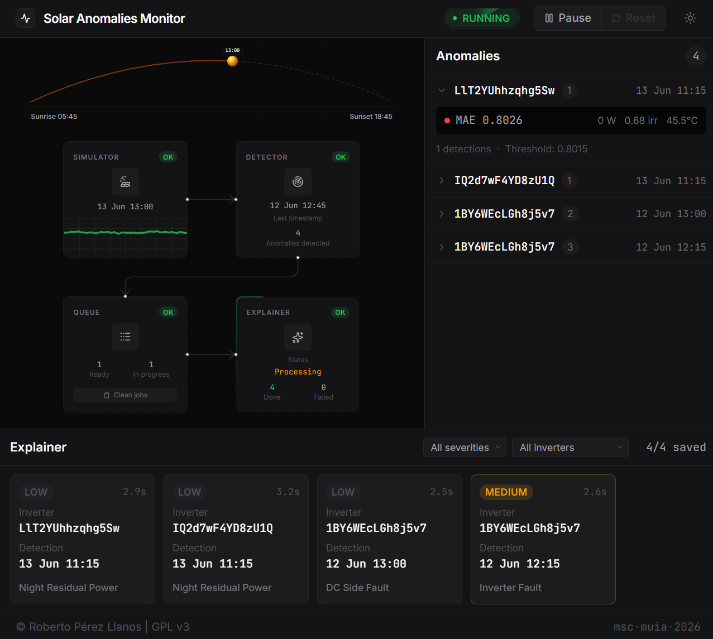

# msc-muia-2026

## Procesamiento de contextos extensos en el Edge para la detección y explicación de anomalías industriales.

> [!NOTE]
> El modelo entrenado no se incluye en este repositorio por su tamaño. Los documentos utilizados para la base de conocimiento RAG tampoco se incluyen por razones de derechos de autor.

<div align="center">
  <picture>
    <source media="(prefers-color-scheme: light)" srcset="assets/fig-09_dashboard_full-run-light.png">
    
  </picture>
</div>

### Descripción

Workflow de monitorización, detección y explicabilidad de anomalías en entornos de producción solar mediante una combinación de Machine Learning clásico y modelos generativos para su aplicación en el *Edge*.

### Ejecución con Docker

Antes de levantar la plataforma, crea el fichero `core/config.yml` a partir de la plantilla [`core/config.example.yml`](core/config.example.yml) y rellena tus valores:

```bash
cp core/config.example.yml core/config.yml
```

Una vez creado, la construcción y ejecución de toda la plataforma se realiza por medio de docker compose:

```bash
docker compose up --build
```

### Subproyectos

- [`core/`](core/README.md): Pipeline de simulación, detección y explicación + Knowledge API. 
- [`monitor/`](monitor/README.md): Interfaz web de monitorización.
- [`infra/`](infra/README.md): Infraestructura (Postgres, RabbitMQ, MQTT) y migraciones.
- [`training/`](training/README.md): Notebooks de entrenamiento e ingesta de conocimiento para RAG.
- [`models/`](models/README.md): Artefactos entrenados.

## Licencia

[GPL v3](LICENSE.md) © Roberto Pérez Llanos
